# Serve Optimize Architecture

Serve Optimize is a measured optimization system for LLM serving. It does not guess the best server configuration from static rules alone. It builds a bounded set of candidates, runs the relevant measurements, records the evidence, and recommends the best configuration among the candidates that were actually measured or exactly reused from fresh evidence.

The system has two operating modes:

1. Attach Mode measures an endpoint that is already running.
2. Managed Mode launches supported backends, measures them, stops them, and records full lifecycle evidence.

The shared principle is simple: measured runtime behavior is the source of truth.

## Product Map

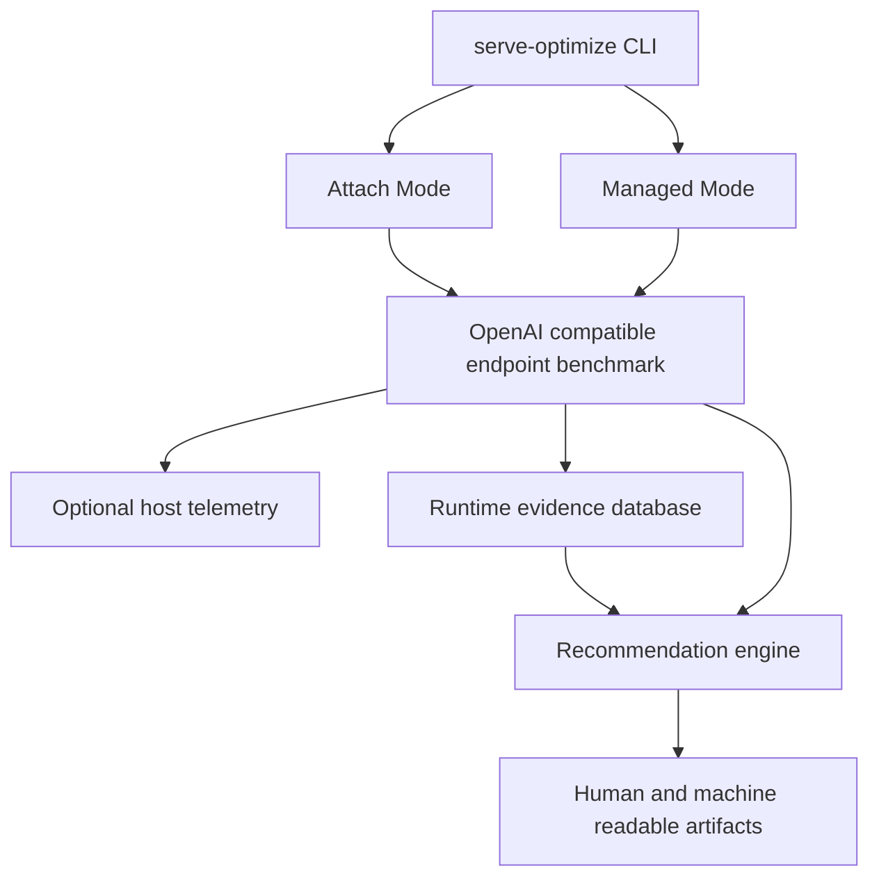

## Main Components

| Layer | What It Does |
|---|---|
| CLI | Parses user intent, hides advanced flags by default, prints the product banner, and dispatches workflows. |
| Hardware discovery | Records GPU, memory, driver, MIG, and platform metadata when available. |
| Model metadata | Reads local or cached Hugging Face config metadata where possible, including dtype and quantization hints. |
| Candidate generation | Creates safe baselines and capability aware backend candidates. |
| Validation | Rejects invalid or unsupported candidates before launch. |
| Backend adapters | Render commands, detect supported flags, launch servers, run health checks, and stop process groups. |
| Endpoint benchmark | Sends OpenAI compatible chat requests, records latency, token counts, errors, and optional stream timing. |
| Telemetry | Samples power, memory, temperature, clocks, utilization, and power limits when the local platform exposes them. |
| Evidence store | Saves measured results with fingerprints so exact reuse is safe and auditable. |
| Recommendation engine | Scores measured candidates, applies SLO eligibility, builds Pareto views, and writes the selected config. |
| Campaign tools | Plan multi model and multi backend validation campaigns. |

## Attach Mode

Attach Mode is for a server the user already started. Serve Optimize does not own that process. It measures the endpoint and recommends among load shapes or candidate metadata that can be tested against the live endpoint.

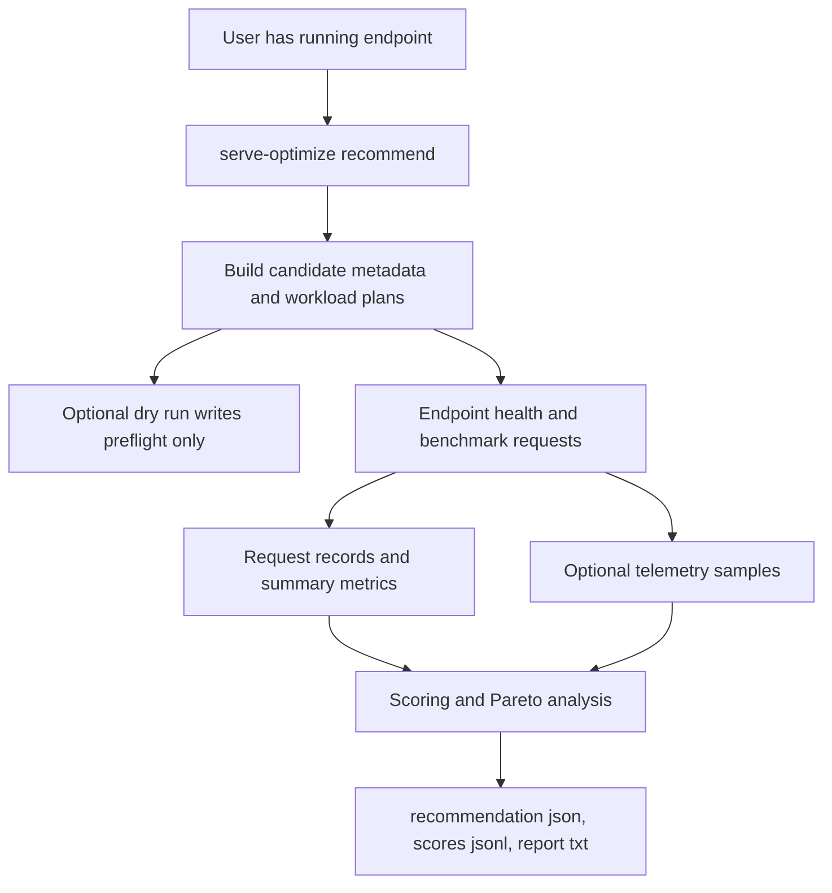

Attach Mode can answer:

1. How this endpoint behaves under a selected workload.
2. Which measured load shape is best among the candidates sent to the endpoint.
3. Whether the endpoint has useful throughput, latency, power, and stream timing behavior.

Attach Mode cannot answer:

1. Whether the endpoint was launched with a proposed command.
2. Whether a different backend launch configuration would be better.
3. Whether the running server matches candidate launch flags.

That boundary is why Attach Mode reports include a caveat. They are real endpoint measurements, but they are not managed launch proof.

## Managed Mode

Managed Mode owns the server lifecycle. It generates candidates, validates them, launches vLLM or SGLang, measures each workload, records evidence, stops the backend process group, and then recommends a configuration.

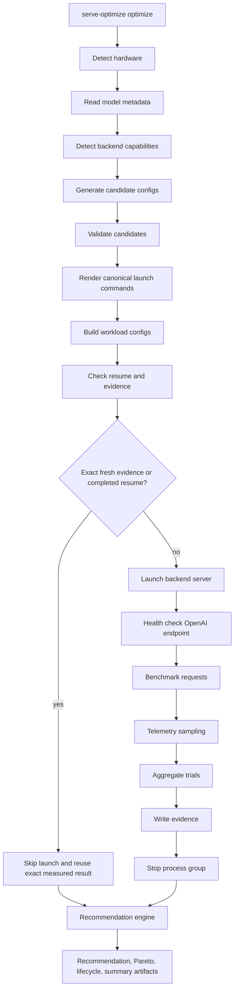

Managed Mode is the path used for production style backend comparison because it controls the launch command and captures the runtime identity.

## Backend Adapters

Backends are isolated behind adapters. The current managed backends are vLLM and SGLang.

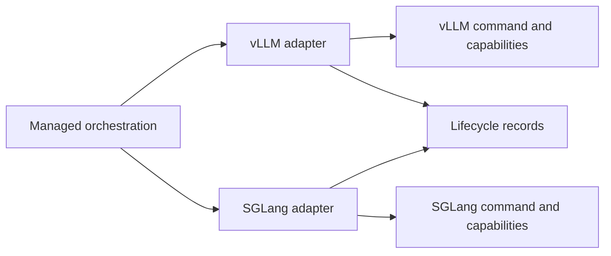

Each adapter owns:

1. Availability detection.
2. Version detection.
3. Help parsing and capability detection.
4. Command rendering.
5. Canonical launch metadata.
6. Server start.
7. Health checks.
8. Process group stop.
9. stdout and stderr log locations.

This keeps backend command details out of the generic optimizer. Unsupported flags are rejected or recorded before launch. They are not silently translated.

## Candidate Generation

Candidate generation starts conservative. Every managed candidate set begins with a safe backend default baseline. Other candidates are added from backend capabilities, workload profile hints, prior evidence, and optional AIConfigurator outputs.

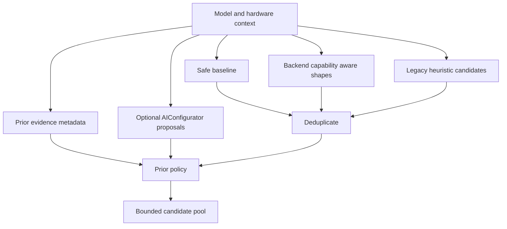

Candidate sources are advisory until a candidate passes validation and measurement.

The candidate pool may include:

1. Backend defaults.
2. Higher concurrency variants.
3. Different context lengths.
4. Different request capacities.
5. Chunked prefill choices when supported.
6. Prefix cache candidates for repeated prefix workloads when supported.
7. Quantization candidates only when model metadata says they are compatible.
8. AIConfigurator candidates when they can be mapped safely into managed backend fields.

## Validation

Validation protects the run before expensive launches happen.

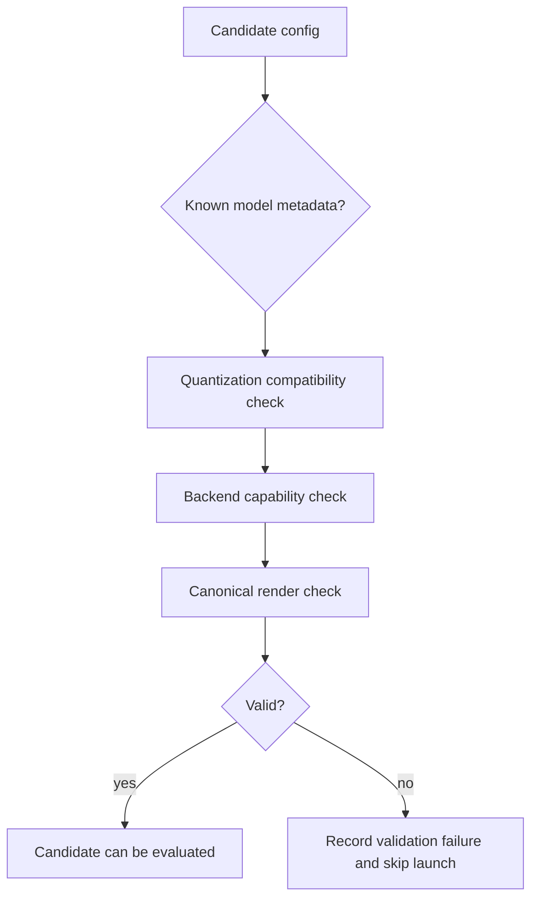

Validation rejects:

1. Incompatible quantization.
2. Unsupported backend flags.
3. Invalid numeric values.
4. Unsafe or ambiguous cross backend translations.
5. Command surfaces that cannot represent required fields.

Rejected candidates are written to `candidate_failures.jsonl`. They are visible, but they are not launched.

## Canonical Launches And Launch Groups

Logical candidate configs are rendered through the active backend adapter. The rendered result becomes the canonical launch identity.

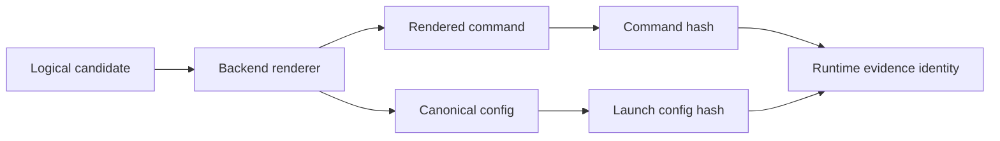

Managed Mode groups candidates that share the same canonical launch configuration. A single launched server can serve multiple workload configs when the launch identity is the same. This reduces redundant backend launches while keeping workload measurements separate.

Important launch artifacts:

1. `rendered_launch_configs.jsonl`
2. `launch_groups.json`
3. `launch_specs.jsonl`
4. backend stdout and stderr logs

## Workloads

A workload describes how the endpoint is measured. It includes concurrency, request count, prompt, generated token limit, timeout, stream mode, warmup, steady state window, soak time, and idle baseline policy.

For managed candidates, workload profile concurrency is a floor. Candidate specific concurrency can go higher for throughput exploration. Throughput mode includes progressively higher candidate concurrency levels so the run can look for server saturation. Request counts are raised when needed so the measured window still covers the configured concurrency after warmup.

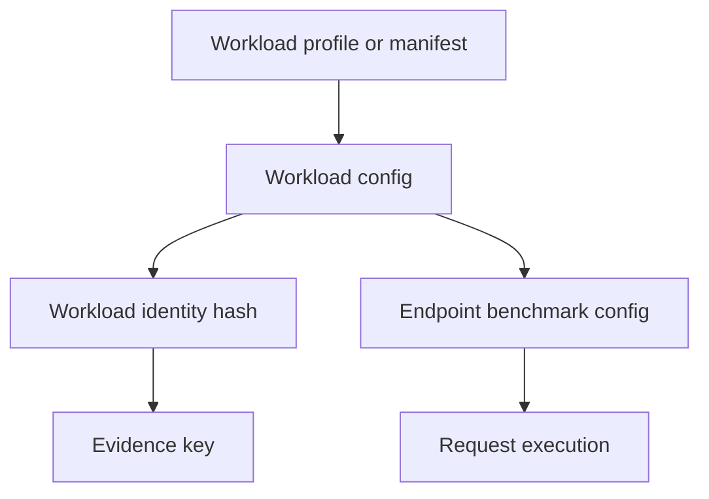

Built in profiles include:

1. `default`
2. `short`
3. `medium`
4. `long`
5. `decode-heavy`
6. `repeated-prefix`
7. `mixed`

SLO constraints are eligibility rules. If a candidate violates a configured SLO, it is not recommendable for that run. SLOs can cover TTFT, TPOT, p95 latency, minimum throughput, and failed request rate.

## Data Collection

The endpoint benchmark is shared by Attach Mode and Managed Mode.

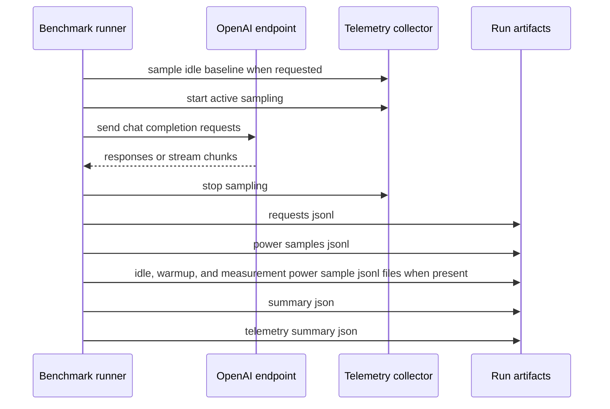

For every request, Serve Optimize records:

1. Request id.
2. Start and end time.
3. Latency.
4. Status.
5. Error text when present.
6. Prompt tokens, completion tokens, and total tokens when the endpoint returns usage.
7. TTFT and chunk cadence TPOT when streaming chunks are observed.
8. Timing and token count source metadata.
9. Client submit time, client start time, and client queue delay when the shared client runner owns request scheduling.

For telemetry, it records what the provider exposes:

1. Power.
2. GPU and memory utilization.
3. Memory used and total memory.
4. Temperature.
5. SM and memory clocks.
6. Power limits.
7. Throttle reasons.
8. Provider warnings and missing fields.

Missing telemetry fields are recorded as unavailable, not as zero.

When telemetry is enabled, idle baseline samples are collected before the active run when requested. Active power samples are phase tagged into warmup and measurement windows when those windows are configured, and the benchmark writes separate idle, warmup, and measurement sample artifacts when those samples exist.

## Metric Computation

Request records and telemetry samples are summarized into benchmark metrics.

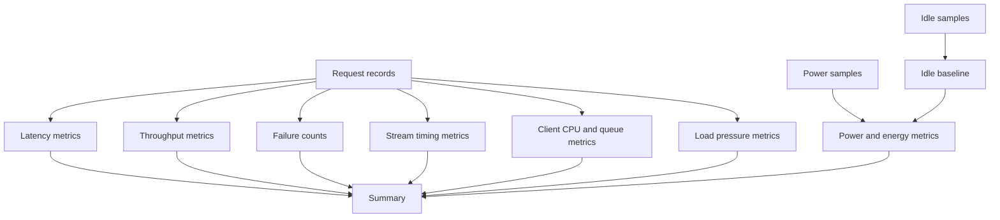

The summary includes:

1. Total token throughput.
2. Output token throughput.
3. Request rate.
4. Average, p50, p95, and p99 latency.
5. TTFT and TPOT when streaming is available.
6. Gross active energy.
7. Idle subtracted active energy when an idle baseline exists.
8. Energy accounting mode, either raw or idle subtracted.
9. Joules per token from the measurement window.
10. Joules per generated token.
11. Tokens per joule.
12. Tokens per watt.
13. Warmup and measurement power sample counts and averages.
14. Temperature rise and thermal stability classification.
15. Trial statistics and confidence intervals for repeated trials.
16. Client issue rate, request backlog, token backlog, GPU saturation signal, and run level load sufficiency classification for throughput pressure checks.

Prefill and decode energy attribution is not claimed. The current endpoint and telemetry path does not expose defensible phase boundary markers.

## Evidence

Evidence is stored in SQLite. It is keyed by hardware, backend, model, telemetry, launch, workload, and runtime identity.

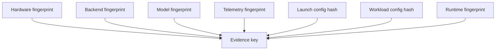

Runtime fingerprinting includes:

1. Backend name and version.
2. Torch version.
3. CUDA runtime version.
4. Python version.
5. Compiler toolchain identity.
6. Project git commit when available.
7. Rendered launch command hash.
8. Backend capability help hash.
9. Canonical launch config identity.
10. Model identity.
11. Workload identity.

Evidence lookup can return:

| Result | Meaning |
|---|---|
| Exact fresh | Same key, fresh measured evidence, compatible telemetry. Can skip measurement. |
| Exact stale | Same key, but outside freshness policy. Prior only. |
| Near compatible | Same hardware, backend, and model, but launch or workload differs. Prior only. |
| Prior only | Related row exists, but core fingerprints differ. Prior only. |
| Runtime drift | Runtime identity changed. Not reusable as exact truth. |
| Unsupported | Stored launch depends on options unsupported by the current backend surface. |
| Missing | No useful row exists. Measure normally. |

Only exact fresh measured evidence can skip a managed workload.

## Resume

Resume is separate from evidence reuse. It reads a previous managed run directory and reuses completed measured workloads when the current plan still has the same candidate id, workload id, launch hash, and workload hash.

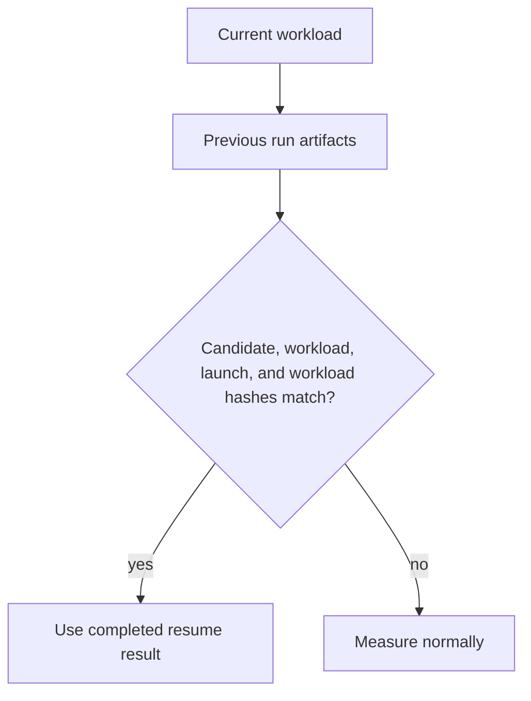

Resume does not reuse failed, incomplete, unavailable, or drifted workloads.

## Pruning And Staged Evaluation

Managed Mode avoids measuring every possible configuration. It keeps the search bounded.

There are two places where candidates are reduced:

1. Prior pruning happens before measurement. It keeps the safe baseline, backend defaults, diversity, low memory candidates, exact evidence candidates, and high value prior candidates.
2. Staged evaluation happens during measurement. Cheap probe runs decide which candidates advance to regular measurement and validation.

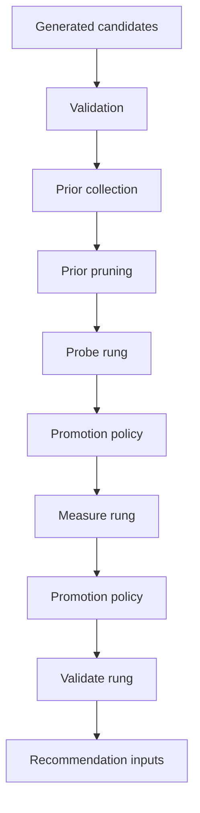

Promotion preserves:

1. The baseline candidate.
2. Nondominated throughput and energy points when both metrics are available.
3. Top goal scoring candidates.
4. Strong prior candidates that produced probe results.
5. Launch diversity until the promotion budget is reached.

The goal is not exhaustive search. The goal is to spend measurement budget on a useful and inspectable set while keeping a trustworthy baseline.

## Recommendation Engine

Final recommendations use only measured results, resumed measured results, or exact fresh measured evidence hits.

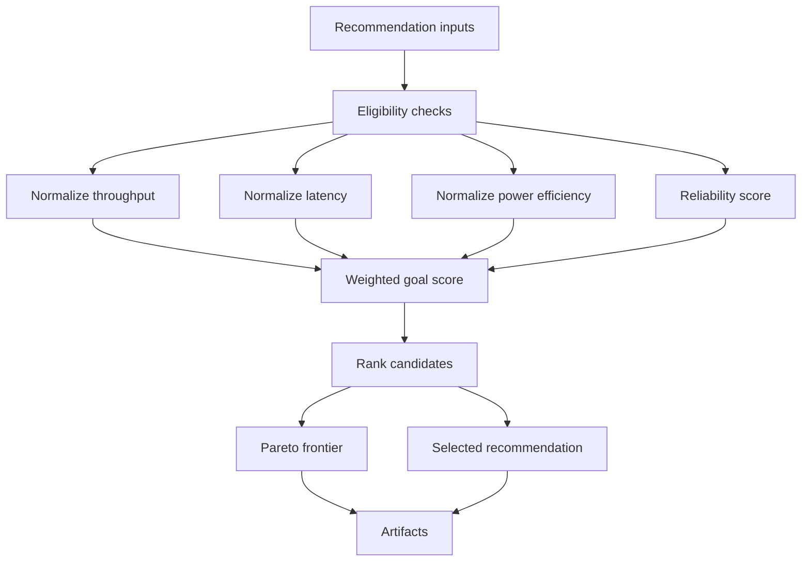

The scoring goals are:

| Goal | Primary Bias |
|---|---|
| Throughput | Maximize total token throughput, with reliability, latency, and power as supporting signals. |
| Latency | Minimize p95 latency, with reliability and power as supporting signals. |
| Efficiency | Maximize power efficiency and minimize joules per token, then consider reliability and latency. |
| Balanced | Combine throughput, latency, reliability, and power when power telemetry is usable. |

Candidates can be disqualified before scoring if they have no successful requests, missing required metrics, missing power telemetry for efficiency, or SLO violations.

The recommendation output includes:

1. Selected candidate id.
2. Selected command.
3. Measured metrics.
4. Telemetry metrics.
5. Score weights and score breakdown.
6. Candidate ranking.
7. Pareto frontier.
8. Alternative objective winners.
9. Confidence level and reasons.
10. Baseline comparison.
11. Optimizer quality metadata.

## Artifact Flow

```mermaid
flowchart TB
    A[Managed run directory]
    A --> B[managed_run json]
    A --> C[rendered_launch_configs jsonl]
    A --> D[workload_configs jsonl]
    A --> E[server_lifecycle jsonl]
    A --> F[candidate_failures jsonl]
    A --> G[evidence_decisions jsonl]
    A --> H[per_candidate benchmark artifacts]
    A --> I[managed_recommendation json]
    A --> J[recommendation_summary txt and json]
    A --> K[managed_pareto_frontier csv and json]
    A --> L[optimizer_quality json]
    A --> M[client_saturation json]
    A --> N[load_sufficiency json]
```

Human readers should start with `recommendation_summary.txt`. Automation should use the JSON and JSONL artifacts.

## Campaigns

Campaign tools scale the same managed flow across models, backends, goals, workload profiles, and repeats.

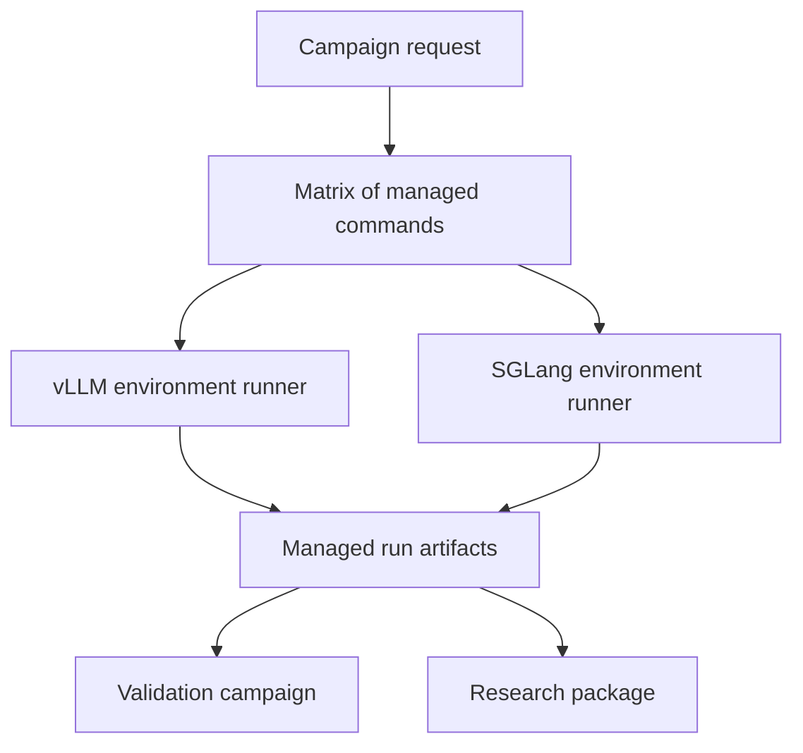

Generated campaign scripts inherit the active shell environment. They do not activate backend environments internally.

## Failure Model

Managed Mode records failures instead of hiding them.

| Stage | Example |
|---|---|
| Availability | Backend executable or capability surface is missing. |
| Validation | Candidate asks for unsupported quantization or flags. |
| Launch | Backend process cannot start. |
| Health | Server starts but does not answer compatible health requests. |
| Benchmark | Requests fail or timeout. |
| Evidence | Database read or write warning. |
| Stop | Process group cleanup warning. |
| Interruption | Operator stops the run. |

If a backend handle exists, cleanup runs through the stop path even after a health or benchmark failure.

Candidate failure records keep the broad lifecycle stage and a machine readable `details.reason` taxonomy. Current reasons include `invalid_config`, `out_of_memory`, `backend_failed_to_start`, `backend_crashed_during_load`, `benchmark_timeout`, `request_timeout`, `unavailable_model`, `unavailable_gated_access`, and `backend_unavailable`. Intentional non measurement paths such as dry run, resume reuse, and exact evidence reuse are recorded separately and are the only paths represented as skipped launch work.

## Product Boundaries

Serve Optimize supports measured configuration optimization with:

1. Attach Mode for OpenAI compatible endpoints.
2. Managed Mode for vLLM.
3. Managed Mode for the detected supported SGLang surface.
4. Runtime fingerprinted evidence.
5. Managed resume.
6. Campaign planning.
7. Validation and research packaging from existing artifacts.

Explicit limits:

1. Recommendations are bounded to evaluated candidates.
2. The candidate search is not exhaustive.
3. vLLM and SGLang use separate environments.
4. TensorRT LLM is not a managed backend.
5. External TGI, LMDeploy, llama.cpp, and NIM are Attach Mode only unless lifecycle ownership is added later.
6. Production trace manifests are not yet first class workload inputs.
7. Prefill and decode energy attribution is unavailable until defensible phase markers exist.
